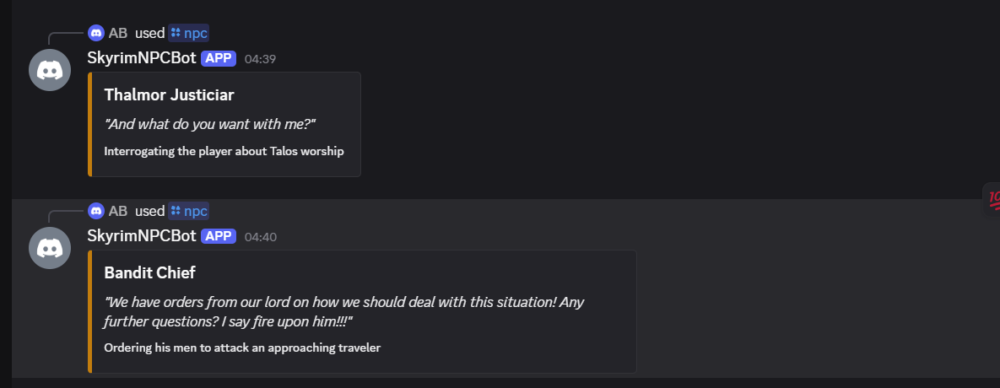
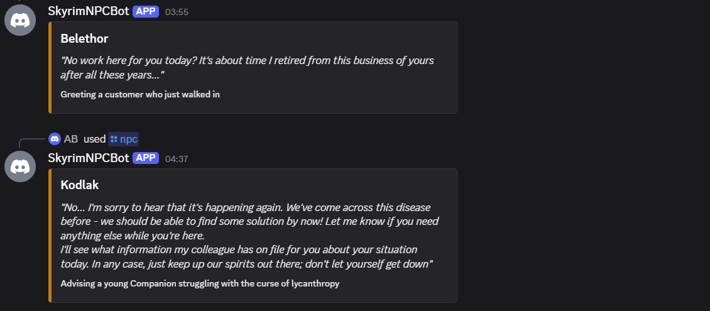

# SkyrimNPCBot

A Discord bot that generates in-character Skyrim NPC dialogue. Type `/npc character:Belethor situation:Greeting a customer` and get a line back that (usually) sounds like Belethor.

I built this as a portfolio project after a year of self-studying AI/ML, coming from five years in Unreal Engine and VR game development. The real goal underneath it: figure out whether small, cheap fine-tunes can hold a character's voice well enough to be useful, since that's the foundation for a longer-term idea I have about AI-driven NPCs in location-based VR arcades. This project is the "can I even get the basics right" step before that.

## What it does

You give it a character name and a short situation. It returns one or two lines of dialogue in that character's voice, styled like Skyrim's in-game barks.

```
/npc character:Bandit situation:Threatening the player on the road
> "Money or your life, traveler. I won't ask twice."
```




## How it's built

**Data.** I scraped NPC dialogue from the Elder Scrolls Fandom wiki using the MediaWiki API's raw wikitext endpoint, not the rendered HTML, because dialogue lives inside templates that don't come through cleanly as plain text. Ended up with about 4,357 examples across 1,168 NPC pages after filtering and deduplication.

**Model.** I started with GPT-2 (124M parameters) because it was cheap to iterate on. It didn't work. More training data per character didn't help, and the eval loss stayed stubbornly high with no overfitting signal, which told me this wasn't a data problem. It was a capacity problem: the model was too small to hold anything beyond a shallow imitation. I switched to Qwen2.5-1.5B-Instruct (Apache 2.0 license, decent small-model benchmarks) and trained a LoRA adapter on top of it instead of the full model. Three epochs on a Colab T4, about 38 minutes. Perplexity dropped from 61.4 on the base model to 2.44 after fine-tuning, though perplexity alone doesn't tell you much since the model is scored on the same distribution it was trained on. See Evaluation below for the numbers that actually mattered.

**The wikitext bug.** About three months into the project I noticed roughly 8% of my training examples still had raw `[[link|display]]` markup sitting in them, unescaped. Traced it to two separate bugs in the scraper: one regex that missed a malformed link pattern, and a section-header function that never ran the cleaning step at all. Fixed both, reran the whole scrape, retrained. This is the kind of bug that's easy to miss because the model still trains and still produces plausible-looking output; it just quietly degrades quality in a way you won't catch unless you go looking.

**Deployment, round one.** I put the bot on an EC2 t3.micro (free tier) running the model quantized to GGUF via llama.cpp, since the free-tier box has no GPU and barely enough RAM. It worked, but a single Discord response took four to five minutes. Technically functional. Not something you'd actually want to use.

**Deployment, round two.** I moved inference to a serverless GPU endpoint on RunPod (vLLM, a 24GB card, pay-per-second). The Discord bot itself stayed on the free EC2 box, but now it just makes an HTTP call instead of loading the model locally. Cold start on an idle worker is around a minute and a half; once it's warm, generation takes two to three seconds. That's the difference between "cute prototype" and "something you'd put in an actual Discord server."

**A bug I didn't expect.** After switching to the GPU endpoint, I noticed the model would occasionally repeat itself across unrelated requests, one NPC's line bleeding into another's, or a response spiraling into repeating the same word over and over. Turned out my new request payload wasn't passing `repetition_penalty`, `top_p`, or `max_tokens` the way my original CPU-based generation script had. The GPU endpoint was silently falling back to more permissive defaults. Once I added those parameters back explicitly, the repetition problem went away. It's a good reminder that swapping infrastructure can silently drop behavior you'd built and tested for, even when the model itself hasn't changed at all.

## Evaluation

Everything above, until recently, was me reading generations and forming opinions. That's how I noticed the RLHF drift and figured out the repetition bug, but "this feels off" isn't a number, and I wanted one before calling any of this done.

I built a small harness (`eval/`) around 40 hand written cases spanning merchants, guards, bandits, followers, mages, and a handful of deliberately awkward prompts (a bandit asked to write a kitten poem, an NPC asked about Postgres, an empty situation string). Each case runs three times at the sampling settings the bot actually uses, against both the base model and the fine-tune, so the comparison is apples to apples rather than a fine-tune graded on vibes alone.

The checks are cheap on purpose. No LLM judge; five deterministic and statistical checks, each tied to a failure I'd actually seen: wiki markup leaking into output, RLHF-style refusal language showing up somewhere a threatening bandit shouldn't sound apologetic, degenerate token repetition, responses that are empty or run away, and lexical diversity per character so a single generation can't hide inside an average.

**What the numbers said, base model versus fine-tune, 120 generations each:**

- Refusal register dropped from 0.8% to 0%. The fine-tune is slightly less prone to slipping into "as an AI, I cannot" phrasing than the base model, not more.
- Repetition looked bad at first glance, a mean of 1.48 repeated 3-grams against a healthy baseline near 1.0. One generation turned out to be doing all the damage: a bandit, asked to write a friendly kitten poem, generated the word "Ha" fifty eight times in a row and stopped. Once that single row is set aside, repetition sits at 1.01 versus the base model's 1.00. Statistically flat, not a regression.
- Lexical diversity told the same story. 0.929 for the base model against 0.898 for the fine-tune overall, which looked like a real drop until I excluded that same degenerate row and it closed to 0.926. One bad generation in a batch of nine was enough to drag an entire character's diversity score down, which turned out to be true of Bandit specifically once I checked.
- I'd claimed in an earlier version of this README that Brynjolf specifically came out flat. The eval data doesn't back that up: his diversity score sits near the top of the range, not the bottom. That claim was based on reading maybe a dozen of his lines and not liking them, which is exactly the kind of thing a real harness is supposed to catch. I'm leaving this note here instead of quietly deleting the old claim, because being wrong about your own model and then measuring it properly is a more useful thing to show than pretending the first read was right.

What this doesn't tell me: whether any character's *personality* stays consistent across generations, since lexical diversity measures word choice, not whether the model's read on who Brynjolf is stays coherent from one response to the next. That would need either a rubric an LLM judge scores against, or me reading a lot more output by hand. Neither happened yet. I'd rather say that plainly than let a clean looking number imply more than it measures.

Run it yourself:

```bash
python eval/run_eval.py --label base --model Qwen/Qwen2.5-1.5B-Instruct --out eval/results_base.json
python eval/run_eval.py --label lora-v1 --model <your-endpoint> --out eval/results_lora.json
python eval/run_eval.py --compare eval/results_base.json eval/results_lora.json
```

## What works and what doesn't

Most characters land well. Guards sound like guards, merchants haggle like merchants, and a Legate barking orders to crush a rebellion reads like something that could genuinely be in the game.

It's not perfect. Every so often, especially on characters I'd call "morally complicated" like bandits, the model has swerved into an apologetic, RLHF-flavored register that has nothing to do with Skyrim, though the eval numbers above suggest this happens less often in the fine-tune than in the base model, not more. My guess is that Qwen's instruction-tuning baked in a lot of "be nice and cooperative" behavior, and a LoRA adapter this size (rank 8, about 4,000 training examples) doesn't have enough weight to fully override that on every single generation. There's also the one reproducible failure mode the eval caught directly: a specific kind of tonal collision, a threatening character asked to do something gentle, can send the model into a token repetition loop. It happened once in 120 generations. I know exactly which prompt triggers it and roughly why, which is more than I could say about any of this before I built the harness.

## Cost and infrastructure notes

The EC2 box is free tier and stays that way regardless of how the model is deployed. The RunPod GPU endpoint only charges while a worker is actually running, and scales to zero when idle, so for a low-traffic Discord bot the actual monthly cost is close to nothing. If traffic ever grew enough that cold starts became a real problem, the next lever would be keeping a worker warm intentionally, which trades a small ongoing cost for consistently fast responses.

## Stack

- **Data**: MediaWiki API, Python, regex-based wikitext cleaning
- **Training**: HuggingFace `transformers`/`peft`/`trl`, PyTorch, Google Colab (T4)
- **Model**: Qwen2.5-1.5B-Instruct + LoRA adapter (r=8)
- **Serving**: vLLM on RunPod serverless (GPU), llama.cpp/GGUF as a CPU fallback path
- **Bot**: `discord.py`, deployed as a systemd service on AWS EC2 (t3.micro, free tier)
- **Eval**: a small custom harness (`eval/`), deterministic and statistical checks, no LLM judge

## What I'd do differently next time

I'd add the sampling parameters and evaluation harness before the first deployment, not after chasing a bug in production. And I'd budget time upfront for the model-capacity question instead of discovering it after weeks of trying to fix GPT-2 with more data. In hindsight, the underfitting signal was there early: high loss, no overfitting gap, no improvement from adding examples. I just didn't recognize the pattern yet. I'd also build the eval harness before forming opinions about individual characters, since at least one of those opinions turned out to be wrong.